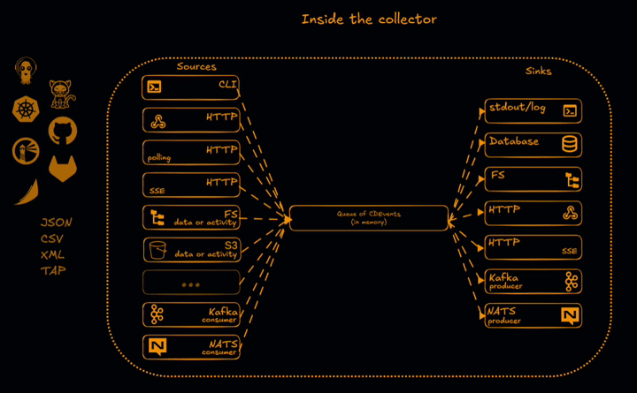

<div align="center">
  
  <h1>cdviz-collector</h1>
  <p>
    <a href="https://github.com/cdviz-dev/cdviz-collector/actions/workflows/ci.yml"></a>
    <a href="https://github.com/cdviz-dev/cdviz-collector/releases/latest"></a>
    <a href="https://hub.docker.com/r/cdviz-dev/cdviz-collector"></a>
    <a href="https://crates.io/crates/cdviz-collector"></a>
    <a href="LICENSE"></a>
  </p>
  <p><strong>keywords:</strong> <code>cdevents</code> · <code>sdlc</code> · <code>cicd</code> · <code>observability</code> · <code>devops</code></p>
  <p>A service &amp; CLI to collect SDLC/CI/CD events from any source and dispatch them as <a href="https://cdevents.dev/">CDEvents</a>.</p>
  <p>
    <strong><a href="https://cdviz.dev/docs/cdviz-collector/">Documentation</a></strong> |
    <a href="https://cdviz.dev/docs/cdviz-collector/quick-start">Quick Start</a> |
    <a href="https://cdviz.dev/docs/cdviz-collector/install">Installation</a>
  </p>
</div>

---

## Features

**Sources**

- Push (inbound): HTTP webhook, HTTP SSE, Kafka, NATS
- Pull (polling): File system, S3, `HTTP` polling (any REST/JSON API — `Jenkins`, `Jira`, custom web APIs, …)

**Sinks**: `HTTP` webhook · `HTTP` SSE · File system · `Kafka` · `NATS` · `PostgreSQL` · `ClickHouse`

**Parsers**: `JSON` · `JSONL` · `CSV` · `XML` · `YAML` · `TAP` · `text` / `text_line`

**Transformations**: [VRL](https://vector.dev/docs/reference/vrl/) (Vector Remap Language) — reshape, filter, split, enrich events before dispatch

**Three CLI modes**: `connect` (long-running server) · `send` (one-shot or wrap a command) · `transform` (batch offline)

## Use Cases

- **Capture CI/CD pipeline events** from GitHub Actions, GitLab CI, Jenkins → normalized `CDEvents`
- **Wrap test commands** — emit `testsuiterun` started/finished events with JUnit/TAP/SARIF results
- **Poll REST APIs** (Jenkins, Jira, any HTTP endpoint) and forward changes as `CDEvents`
- **Bridge message streams** — consume Kafka/NATS topics, re-publish as `CDEvents` to `PostgreSQL` or `ClickHouse`
- **Observe deployments & artifacts** — track environment changes and artifact publications
- **Feed [CDviz](https://cdviz.dev) dashboards** with normalized SDLC telemetry

## Installation

- **Pre-built binaries** for Linux and macOS → [GitHub Releases](https://github.com/cdviz-dev/cdviz-collector/releases)
- **Docker image** → `ghcr.io/cdviz-dev/cdviz-collector`
- **Helm chart** for Kubernetes
- **Cargo** → `cargo install cdviz-collector`
- **Mise** → `mise install "github:cdviz-dev/cdviz-collector"`

See the [Installation Guide](https://cdviz.dev/docs/cdviz-collector/install).

## Getting Started

See the [Quick Start Guide](https://cdviz.dev/docs/cdviz-collector/quick-start) for a 5-minute walkthrough.

## Architecture

Pipeline: **sources** → in-memory queue → multiple **sinks** (fan-out).



## Configuration

TOML files with environment variable overrides:

- **Example:** [examples/assets/cdviz-collector.toml](examples/assets/cdviz-collector.toml)
- **Base config:** [src/assets/cdviz-collector.base.toml](src/assets/cdviz-collector.base.toml)
- **Env override pattern:** `CDVIZ_COLLECTOR__SECTION__KEY__VALUE`

See the [Configuration Guide](https://cdviz.dev/docs/cdviz-collector/configuration).

## Usage

### `connect` — Run as a Service

Long-running server connecting sources to sinks.

```bash
cdviz-collector connect --config cdviz-collector.toml
```

See [connect docs](https://cdviz.dev/docs/cdviz-collector/connect).

### `send` — One-Shot or Wrap a Command

Send JSON directly to a sink, or wrap a command to emit lifecycle `CDEvents` automatically.

```bash
# Send raw JSON
cdviz-collector send --url https://api.example.com/webhook --data '{"test": "value"}'

# Wrap a test run — emits testsuiterun started + finished CDEvents with JUnit results
cdviz-collector send --run testsuiterun-junit -- pytest --junitxml=report.xml

# Wrap any task — emits taskrun started + finished CDEvents
cdviz-collector send --run taskrun -- ./deploy.sh
```

`--run` captures exit code and output artifacts, then emits lifecycle `CDEvents` (started → finished). Built-in run types: `testsuiterun-junit`, `testsuiterun-tap`, `taskrun`.

See [send docs](https://cdviz.dev/docs/cdviz-collector/send).

### `transform` — Batch File Transformation

Offline transformation of local files using configured VRL transformers.

```bash
cdviz-collector transform --input ./input --output ./output --transformer-refs github_events
```

See [transform docs](https://cdviz.dev/docs/cdviz-collector/transform).

---

For all options: `cdviz-collector --help` or `cdviz-collector <command> --help`.

## Related Projects

| Project                                                     | Role                                                                          |
| ----------------------------------------------------------- | ----------------------------------------------------------------------------- |
| [CDviz](https://cdviz.dev)                                  | SDLC observability dashboard — consumes `CDEvents` produced by this collector |
| [send-cdevents](https://github.com/cdviz-dev/send-cdevents) | GitHub Action wrapping `cdviz-collector send`                                 |
| [CDEvents spec](https://cdevents.dev)                       | CloudEvents-based open standard for SDLC events                               |
| [VRL](https://vector.dev/docs/reference/vrl/)               | Transformation language used by transformers                                  |

## AI Assistant Skill

Install the [agent skill](https://agentskills.io) for help configuring pipelines, writing VRL transformers, mapping `CDEvent` types, and debugging. Works with Claude Code, GitHub Copilot, Cursor, and [other supported agents](https://github.com/vercel-labs/skills).

```bash
npx skills add cdviz-dev/cdviz-collector
```

In Claude Code, invoke with `/cdviz-collector`.

## Development

Uses [mise](https://mise.jdx.dev/) for task management:

```bash
mise install          # Setup environment
mise run build        # Build project
mise run test         # Run tests
mise run lint         # Run linting
mise run ci           # Full CI pipeline
```

See [CONTRIBUTING.md](CONTRIBUTING.md) for guidelines.

## License

Apache Software License 2.0 ([ASL-2.0](LICENSE)). Commercial support: <https://cdviz.dev>.

- **Built-in scripts** (this repo): Apache-2.0
- **User-provided scripts** (loaded at runtime): any license

See [LICENSING.md](LICENSING.md) for exceptions.

## Contributing

Contributions welcome — see [Contributing Guide](./CONTRIBUTING.md) and [CLA](https://cla-assistant.io/cdviz-dev/cdviz-collector).

[cdevents]: https://cdevents.dev/

## Downloads

<div align="center">
    <a href="https://download-history.cdviz.dev/?repo=cdviz-dev%2Fcdviz-collector"></a>
    <a href="https://download-history.cdviz.dev/?repo=cdviz-dev%2Fcdviz-collector"></a>
</div>
