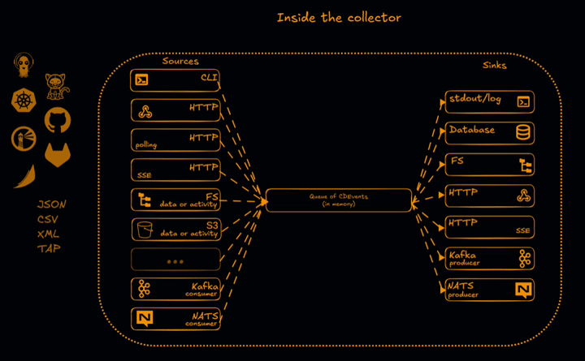

<div align="center">
  
  <h1>cdviz-collector</h1>
  <p>
    <a href="https://github.com/cdviz-dev/cdviz-collector/actions/workflows/ci.yml"></a>
    <a href="https://github.com/cdviz-dev/cdviz-collector/releases/latest"></a>
    <a href="https://hub.docker.com/r/cdviz-dev/cdviz-collector"></a>
    <a href="https://crates.io/crates/cdviz-collector"></a>
    <a href="LICENSE"></a>
  </p>
  <p><strong>keywords:</strong> <code>cdevents</code> · <code>sdlc</code> · <code>cicd</code> · <code>observability</code> · <code>devops</code></p>

  <h3>Turn any tool into a <a href="https://cdevents.dev/">CDEvents</a> producer.</h3>

  <p>
    Receive a webhook. Poll a REST API. Watch a folder or S3 bucket.<br>
    Or just wrap a command. Any of these gets you CDEvents —<br>
    no plugin code, no recompile.
  </p>

  <p>
    <strong><a href="https://cdviz.dev/docs/cdviz-collector/">Documentation</a></strong> |
    <a href="https://cdviz.dev/docs/cdviz-collector/quick-start">Quick Start</a> |
    <a href="https://cdviz.dev/docs/cdviz-collector/install">Installation</a>
  </p>
</div>

---

## Try it in 30 seconds

```bash
cargo install cdviz-collector   # or a binary, Docker image, mise — see Install below
```

Now put `cdviz-collector` in front of a test command you already run:

```bash
cdviz-collector send --run testsuiterun_junit -- pytest --junitxml=report.xml
```

That emits a `testsuiterun.started` CDEvent before your tests, runs them, then emits `testsuiterun.finished` with the parsed results and the outcome. A failing test run still fails the step, so it is safe to leave in a pipeline.

In GitHub Actions, GitLab CI, or Jenkins it needs no configuration at all: it reads the repository, run id, job, and workflow straight from the CI environment.

Built-in run types: `testsuiterun_junit`, `testsuiterun_tap`, `testsuiterun_sarif`, `taskrun`.

## Why normalize events at all

Every tool in your pipeline emits events, and none of them agree on what an event looks like. A GitHub `workflow_run`, a Jenkins build, and an ArgoCD sync all describe "something ran" in three shapes that share nothing.

[CDEvents](https://cdevents.dev/) is the CDF standard that settles the shape. Once your tools speak it, questions that used to need a spreadsheet turn into ordinary queries against one table: how often do we really deploy, how long does a commit take to reach production, what shipped last night, which change landed just before that incident. One timeline across every tool, instead of ten tabs and a guess.

The usual way to get there is a bespoke webhook receiver per tool, each one a small service to write, deploy, and keep alive. Here the mapping is a [VRL](https://vector.dev/docs/reference/vrl/) script in a config file. Change a mapping without shipping a binary.

> **This does not sign you up for anything.** cdviz-collector is standalone: it writes to PostgreSQL, ClickHouse, plain HTTP, or files you already run, and CDEvents is an open [CDF](https://cd.foundation/) standard rather than a format we invented. [CDviz](https://cdviz.dev) is one thing you can point the data at. It is not a requirement.

## The swiss knife

| | |
| --- | --- |
| **Receive** | HTTP webhook (with HMAC signature verification), SSE, NATS, Kafka |
| **Poll** | REST/GraphQL APIs, filesystem, S3, GCS, SFTP, GitHub |
| **Wrap** | any command — exit code plus JUnit/TAP/SARIF reports |
| **Transform** | VRL — reshape, filter, enrich, deduplicate, split one input into N events |
| **Ship to** | PostgreSQL, ClickHouse, HTTP, SSE, NATS, Kafka, files/S3, stdout |

Sinks fan out: one source can feed all of them at once.

**Parsers:** `JSON` · `JSONL` · `CSV` · `XML` · `YAML` · `TAP` · `text` (plus `auto` detection)

> **Kafka** works as both source and sink, but is not in the default build (it needs native libraries). Build with `--features source_kafka,sink_kafka`.

## Works with your tools today

Ready-made transformers live in [transformers-community](https://github.com/cdviz-dev/transformers-community), each with sample inputs and expected outputs:

| Transformer | Converts |
| --- | --- |
| [`github_events`](https://github.com/cdviz-dev/transformers-community/tree/main/github_events) | GitHub webhooks: workflow runs, jobs, releases, pull requests, issues |
| [`github_rest_api`](https://github.com/cdviz-dev/transformers-community/tree/main/github_rest_api) | GitHub REST API, for backfill or polling-only setups |
| [`argocd_notifications`](https://github.com/cdviz-dev/transformers-community/tree/main/argocd_notifications) | ArgoCD application lifecycle events |
| [`kubewatch_cloudevents`](https://github.com/cdviz-dev/transformers-community/tree/main/kubewatch_cloudevents) | Kubernetes events, via Kubewatch |
| [`cdevents`](https://github.com/cdviz-dev/transformers-community/tree/main/cdevents) | CDEvents from one spec version to the next |

Import them straight from GitHub. No clone, no vendoring:

```toml
[remote.transformers-community]
type = "github://cdviz-dev/transformers-community"

[transformers]
github_events = { type = "vrl", template_rfile = "transformers-community:///github_events/to_v0_5.vrl" }
```

GitLab, Jenkins, and Jira transformers are part of the commercial offering — see [cdviz.dev](https://cdviz.dev).

Nothing there for your tool? Write a VRL script. That is the whole extension mechanism — no plugin API to learn.

For REST APIs without webhooks, the [`http_polling`](./src/sources/http_polling/README.md) source drives requests from a VRL script, covering time-windowed polling, Link-header and GraphQL cursor pagination, multi-pass discovery, `Retry-After` handling, and resumable backfill.

## Install

| | |
| --- | --- |
| **Binaries** (Linux, macOS) | [GitHub Releases](https://github.com/cdviz-dev/cdviz-collector/releases) |
| **Docker** | `ghcr.io/cdviz-dev/cdviz-collector` |
| **Cargo** | `cargo install cdviz-collector` |
| **Mise** | `mise install "github:cdviz-dev/cdviz-collector"` |
| **Kubernetes** | Helm chart |

See the [Installation Guide](https://cdviz.dev/docs/cdviz-collector/install).

## Commands

| Command | Purpose |
| --- | --- |
| [`connect`](https://cdviz.dev/docs/cdviz-collector/connect) | Long-running server: sources → transformers → sinks |
| [`send`](https://cdviz.dev/docs/cdviz-collector/send) | Send one event, or wrap a command with `--run` |
| [`transform`](https://cdviz.dev/docs/cdviz-collector/transform) | Transform files offline, in batch |
| `config --check` | Validate config and compile every VRL template — run it in CI |

```bash
# Serve
cdviz-collector connect --config cdviz-collector.toml

# Send raw JSON to a sink
cdviz-collector send --url https://api.example.com/webhook --data '{"test": "value"}'

# Validate config and compile every VRL template
cdviz-collector config --check --config cdviz-collector.toml
```

Full options: `cdviz-collector <command> --help`.

## Architecture

Sources → transformers → in-memory queue → sinks (fan-out).



Events carry OpenTelemetry trace context end to end, so one `trace_id` spans the whole journey from source to sink.

## Configuration

TOML, layered, with `CDVIZ_COLLECTOR__SECTION__KEY` environment overrides. `--config` accepts a local path or an HTTP(S) URL.

- Example: [examples/assets/cdviz-collector.toml](examples/assets/cdviz-collector.toml)
- Defaults: [src/assets/connect.base.toml](src/assets/connect.base.toml), [src/assets/send.base.toml](src/assets/send.base.toml)
- [Configuration Guide](https://cdviz.dev/docs/cdviz-collector/configuration)

## AI assistant skill

Get help configuring pipelines, writing VRL transformers, and mapping CDEvent types. Works with Claude Code, GitHub Copilot, Cursor, and [other agents](https://github.com/vercel-labs/skills).

```bash
npx skills add cdviz-dev/cdviz-collector
```

## Related projects

| Project | Role |
| --- | --- |
| [CDviz](https://cdviz.dev) | SDLC observability dashboard — consumes the CDEvents this produces |
| [send-cdevents](https://github.com/cdviz-dev/send-cdevents) | GitHub Action wrapping `cdviz-collector send` |
| [CDEvents](https://cdevents.dev) | The CloudEvents-based standard for SDLC events |
| [VRL](https://vector.dev/docs/reference/vrl/) | The transformation language |

## Start collecting

Wrap one test command and watch the CDEvents come out:

```bash
cargo install cdviz-collector
cdviz-collector send --run testsuiterun_junit -- pytest --junitxml=report.xml
```

Then read the [Quick Start](https://cdviz.dev/docs/cdviz-collector/quick-start) to point it at a real sink. If this saved you a webhook receiver, a star helps other people find it.

## Contributing

Contributions welcome. See the [Contributing Guide](./CONTRIBUTING.md) and [CLA](https://cla-assistant.io/cdviz-dev/cdviz-collector). The project uses [mise](https://mise.jdx.dev/): `mise install && mise run ci`.

## License

Apache-2.0 ([LICENSE](LICENSE)), with exceptions in [LICENSING.md](LICENSING.md). User-provided scripts loaded at runtime keep any license you like. Commercial support: <https://cdviz.dev>.

## Downloads

<div align="center">
    <a href="https://download-history.cdviz.dev/?repo=cdviz-dev%2Fcdviz-collector"></a>
    <a href="https://download-history.cdviz.dev/?repo=cdviz-dev%2Fcdviz-collector"></a>
</div>
