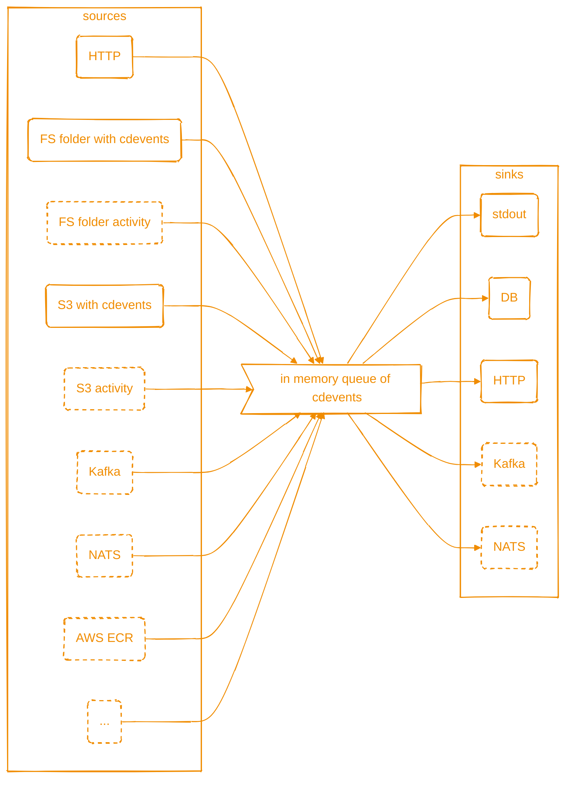

# cdviz-collector

keywords: `cdevents`, `sdlc`, `cicd`
status: wip

A service & cli to collect SDLC/CI/CD events and to dispatch as [cdevents].

Goals:

- to create cdevents by polling some sources (folder on fs, S3, AWS ECR, ...)
- to receive cdevents from http, kafka, nats
- to send (broadcast) cdevents to various destination database, http, kafka, nats
- to expose some metrics (TBD)

cdviz-collector is configured via a config file + override by environment variables.

see [documentation](https://cdviz.dev/docs/cdviz-collector/)

## License

This software is distributed under a dual-licensing model:

1. Affero General Public License Version 3.0 ([AGPL-3.0-only](LICENSE)):
  - The software is available under the AGPL 3.0 license. This means you can use, modify, and distribute the software under the terms of the AGPL 3.0. Any modifications or derivative works must also be licensed under AGPL 3.0.
  - For more details, see the [AGPL-3.0-only](LICENSE).
2. Proprietary License:
  - Alternatively, the software is available under a proprietary license. This option is suitable for users who require different terms or additional permissions not granted by the AGPL 3.0.
  - For more information about obtaining a proprietary license, please contact us at <contact@cdviz.dev>.

By using this software, you agree to comply with the terms of one of the above licenses.

For exceptions, see [LICENSING.md](LICENSING.md).

[cdevents]: <https://cdevents.dev/>
