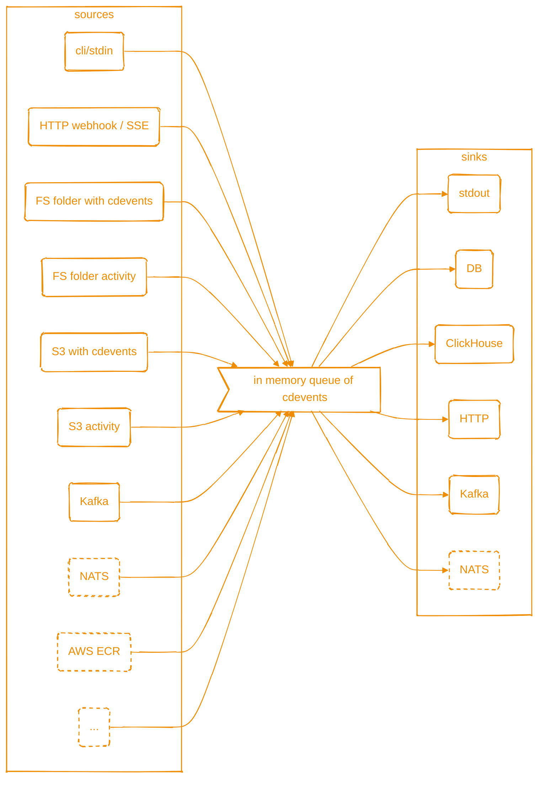

<div align="center">
  
  <h1>cdviz-collector</h1>
  <p>
    <a href="https://github.com/cdviz-dev/cdviz-collector/actions/workflows/ci.yml"></a>
    <a href="LICENSE"></a>
    <a href="https://crates.io/crates/cdviz-collector"></a>
  </p>
  <p><strong>keywords:</strong> <code>cdevents</code>, <code>sdlc</code>, <code>cicd</code></p>
  <p>A service & CLI to collect SDLC/CI/CD events and dispatch as <a href="https://cdevents.dev/">CDEvents</a>.</p>
  <p>
    <strong><a href="https://cdviz.dev/docs/cdviz-collector/">Documentation</a></strong> |
    <a href="https://cdviz.dev/docs/cdviz-collector/quick-start">Quick Start</a> |
    <a href="https://cdviz.dev/docs/cdviz-collector/install">Installation</a>
  </p>
</div>

---

## Features

- Multiple destinations (`HTTP` webhooks, `HTTP SSE`, File system, `Kafka`, `PostgreSQL`, `ClickHouse`)
- Multiple event sources (`HTTP` webhooks, `HTTP SSE`, File system, `S3`, `Kafka`)
- Multi-format parsing: `JSON`, `JSONL`, `CSV`, `XML`, `YAML`, `TAP`, and raw `text`/`text_line`
- Event transformation via `VRL` (Vector Remap Language)
- Three operation modes: server, one-shot sending, batch transformation

For comprehensive feature documentation, see [cdviz.dev/docs/cdviz-collector](https://cdviz.dev/docs/cdviz-collector/).

## Installation

cdviz-collector is distributed as:

- **Pre-built binaries** for Linux and macOS ([GitHub Releases](https://github.com/cdviz-dev/cdviz-collector/releases))
- **Docker image** at `ghcr.io/cdviz-dev/cdviz-collector`
- **Helm chart** for Kubernetes deployments
- **Cargo package** on [crates.io](https://crates.io/crates/cdviz-collector)

See the [Installation Guide](https://cdviz.dev/docs/cdviz-collector/install) for detailed instructions.

## Getting Started

See the [Quick Start Guide](https://cdviz.dev/docs/cdviz-collector/quick-start) for a 5-minute walkthrough.

## Architecture

cdviz-collector uses a pipeline architecture: events flow from **sources** through an in-memory queue to multiple **sinks**.



For detailed architecture information, see [CLAUDE.md](CLAUDE.md).

## Configuration

Configure cdviz-collector via TOML files with environment variable overrides:

- **Example config:** [examples/assets/cdviz-collector.toml](examples/assets/cdviz-collector.toml)
- **Base config:** [src/assets/cdviz-collector.base.toml](src/assets/cdviz-collector.base.toml)
- **Environment variables:** `CDVIZ_COLLECTOR__SECTION__KEY__VALUE`

See the [Configuration Guide](https://cdviz.dev/docs/cdviz-collector/configuration) and [Use Cases & Examples](https://cdviz.dev/docs/cdviz-collector/use-cases) for detailed information.

## Usage

cdviz-collector provides three commands:

### `connect` - Run as a Service

Launch collector as a long-running server to connect sources to sinks.

```bash
cdviz-collector connect --config cdviz-collector.toml
```

See the [connect documentation](https://cdviz.dev/docs/cdviz-collector/connect) for detailed options.

### `send` - Send Events Directly

Send JSON data directly to a sink for testing and scripting.

```bash
cdviz-collector send --url https://api.example.com/webhook --data '{"test": "value"}'
```

See the [send documentation](https://cdviz.dev/docs/cdviz-collector/send) for detailed options.

### `transform` - Batch File Transformation

Transform local JSON files using configured transformers.

```bash
cdviz-collector transform --input ./input --output ./output --transformer-refs github_events
```

See the [transform documentation](https://cdviz.dev/docs/cdviz-collector/transform) for detailed options.

---

For all available options, use `--help` with any command or see the [usage documentation](https://cdviz.dev/docs/cdviz-collector/usage).

### GitHub Action

Send `CDEvents` from GitHub Actions workflows using [cdviz-dev/send-cdevents](https://github.com/cdviz-dev/send-cdevents).

## Development

This project uses [mise](https://mise.jdx.dev/) for task management:

```bash
mise install          # Setup environment
mise run build        # Build project
mise run test         # Run tests
mise run lint         # Run linting
mise run ci           # Full CI pipeline
```

See [CONTRIBUTING.md](CONTRIBUTING.md) for detailed development guidelines.

For AI assistance context, see [CLAUDE.md](CLAUDE.md).

## License

This software is distributed under Apache Software License 2.0 [ASL-2.0](LICENSE).
You can subscribe to commercial support at <http://cdviz.dev>.

By using this software, you agree to comply with the terms of one of the above licenses.

For exceptions, see [LICENSING.md](LICENSING.md).

### Scripts, Transformer's template and Licensing

- **Built-in scripts** (included in this repository) are licensed under Apache Software License 2.0 [ASL-2.0](LICENSE).
- **User-provided scripts** (loaded at runtime) are **not subject to ASL-2.0** and can be under any license.

## Contributing

We welcome contributions! Please see our [Contributing Guide](./CONTRIBUTING.md) for more details.

By contributing to this project, you agree to the [Contributor License Agreement (CLA)](https://cla-assistant.io/cdviz-dev/cdviz-collector).

Note: This project has been developed with assistance from Claude Code. All AI-generated code has been carefully reviewed, tested, and validated to ensure quality, security, and adherence to Rust best practices.

[cdevents]: https://cdevents.dev/

## Downloads

<div align="center">
    <a href="https://download-history.cdviz.dev/?repo=cdviz-dev%2Fcdviz-collector"></a>
    <a href="https://download-history.cdviz.dev/?repo=cdviz-dev%2Fcdviz-collector"></a>
</div>
