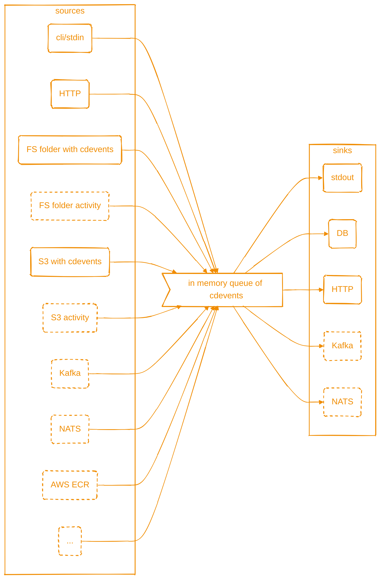

# cdviz-collector

keywords: `cdevents`, `sdlc`, `cicd`

A service & cli to collect SDLC/CI/CD events and to dispatch as [cdevents].

## Goals

- to create cdevents by polling some sources (folder on fs, S3, AWS ECR, ...)
- to receive cdevents from http, kafka, nats
- to send (broadcast) cdevents to various destination database, http, kafka, nats
- to expose some metrics (TBD)

cdviz-collector is configured via a config file + override by environment variables.

see [documentation](https://cdviz.dev/docs/cdviz-collector/)



## Usage

<details>
<summary>cdviz-collector connect <code>[OPTIONS]</code></summary>

```txt
Launch collector as a server to connect sources to sinks.

Runs the collector in server mode, enabling configured sources to collect events and dispatch them to configured sinks through the pipeline. The server provides HTTP endpoints for webhook sources and SSE sinks.

Usage: cdviz-collector connect [OPTIONS]

Options:
      --config <CONFIG>
          Configuration file path for sources, sinks, and transformers.

          Specifies the TOML configuration file that defines the pipeline behavior. If not provided, the collector will use the base configuration with default settings. The configuration can also be specified via the `CDVIZ_COLLECTOR_CONFIG` environment variable.

          Example: `--config cdviz-collector.toml`

          [env: CDVIZ_COLLECTOR_CONFIG=]

  -v, --verbose...
          Increase logging verbosity

  -q, --quiet...
          Decrease logging verbosity

      --disable-otel
          Disable OpenTelemetry initialization and use minimal tracing setup.

          This is useful for testing environments or when you want to avoid OpenTelemetry overhead. When disabled, only basic console logging will be available without distributed tracing capabilities.

  -C, --directory <DIRECTORY>
          Change working directory before executing the command.

          This affects relative paths in configuration files and data files. Useful when running the collector from a different location than where your configuration and data files are located.

  -h, --help
          Print help (see a summary with '-h')
```

</details>

<details>
<summary>cdviz-collector send <code>[OPTIONS]</code> --data <code>&lt;DATA&gt;</code></summary>

```txt
Send JSON data directly to a sink for testing and scripting.

This command allows sending JSON data directly to configured sinks without running a full server. Useful for testing transformations, debugging sink configurations, or scripting event dispatch.

Usage: cdviz-collector send [OPTIONS] --data <DATA>

Options:
  -d, --data <DATA>
          JSON data to send to the sink.

          Can be specified as: - Direct JSON string: '{"test": "value"}' - File path: @data.json - Stdin: @-

          The JSON data will be processed through the configured pipeline and sent to the specified sink.

  -v, --verbose...
          Increase logging verbosity

  -q, --quiet...
          Decrease logging verbosity

  -u, --url <URL>
          HTTP URL to send the data to.

          When specified, automatically enables the HTTP sink and disables the debug sink. The data will be sent as CloudEvents format to the specified endpoint.

          Example: `--url https://api.example.com/webhook`

      --config <CONFIG>
          Configuration file for advanced sink settings.

          Optional TOML configuration file for advanced sink configuration such as authentication, headers generation, or custom sink types. Command line arguments will override configuration file settings.

          [env: CDVIZ_COLLECTOR_CONFIG=]

      --disable-otel
          Disable OpenTelemetry initialization and use minimal tracing setup.

          This is useful for testing environments or when you want to avoid OpenTelemetry overhead. When disabled, only basic console logging will be available without distributed tracing capabilities.

  -C, --directory <DIRECTORY>
          Working directory for relative paths.

          Changes the working directory before processing. This affects relative paths in configuration files and data file references.

  -H, --header <HEADERS>
          Additional HTTP headers for the request.

          Specify custom headers for HTTP sink requests. Can be used multiple times to add several headers. Format: "Header-Name: value"

          Example: `--header "X-API-Key: secret" --header "Content-Type: application/json"`

  -h, --help
          Print help (see a summary with '-h')
```

</details>

<details>
    <summary>cdviz-collector transform <code>[OPTIONS]</code> --input <code>&lt;INPUT&gt;</code> --output <code>&lt;OUTPUT&gt;</code></summary>

```txt
Transform local JSON files using configured transformers.

Processes JSON files from an input directory through configured transformers and writes results to an output directory. Supports validation against CDEvents specification and provides interactive review, overwrite, or check modes for managing output files.

Usage: cdviz-collector transform [OPTIONS] --input <INPUT> --output <OUTPUT>

Options:
      --config <CONFIG>
          Configuration file defining transformers and their settings.

          TOML configuration file that defines available transformers. The file should contain transformer definitions that can be referenced by name using the --transformer-refs option.

          [env: CDVIZ_COLLECTOR_CONFIG=]

  -v, --verbose...
          Increase logging verbosity

  -q, --quiet...
          Decrease logging verbosity

  -t, --transformer-refs <TRANSFORMER_REFS>...
          Names of transformers to chain together.

          Comma-separated list or multiple arguments specifying which transformers to apply in sequence. Transformers are applied in the order specified.

          Example: `--transformer-refs github_events,add_metadata`
          Example: `-t github_events -t add_metadata`

          [default: passthrough]

      --disable-otel
          Disable OpenTelemetry initialization and use minimal tracing setup.

          This is useful for testing environments or when you want to avoid OpenTelemetry overhead. When disabled, only basic console logging will be available without distributed tracing capabilities.

  -i, --input <INPUT>
          Input directory containing JSON files to transform.

          Directory path containing the JSON files to be processed. The tool will recursively search for *.json files, excluding *.headers.json, *.metadata.json, and *.json.new files.

  -C, --directory <DIRECTORY>
          Change working directory before executing the command.

          This affects relative paths in configuration files and data files. Useful when running the collector from a different location than where your configuration and data files are located.

  -o, --output <OUTPUT>
          Output directory for transformed JSON files.

          Directory where transformed files will be written. The directory structure from the input will be preserved. Files will initially be created with .json.new extension before being processed according to the selected mode.

  -m, --mode <MODE>
          How to handle conflicts between new and existing output files.

          Controls the behavior when output files already exist: - review: Interactive review of differences (default) - overwrite: Replace existing files without prompting - check: Fail if differences are found

          Possible values:
          - review:    Interactive review of differences between new and existing output files
          - overwrite: Overwrite existing output files without prompting
          - check:     Check for differences and fail if any are found

          [default: review]

      --no-check-cdevent
          Skip validation that output body is a valid CDEvent.

          By default, the tool validates that transformation results produce valid CDEvent objects. Use this flag to disable validation if you're working with non-CDEvent JSON data.

      --export-headers
          Export headers to separate .headers.json files.

          When enabled, HTTP headers from the original request will be exported to .headers.json files alongside the main JSON output files.

      --export-metadata
          Export metadata to separate .metadata.json files.

          When enabled, event metadata (timestamps, source info, etc.) will be exported to .metadata.json files alongside the main JSON output files.

      --keep-new-files
          Keep temporary .json.new files after processing.

          Normally, temporary .json.new files created during transformation are cleaned up after processing. Use this flag to preserve them for debugging.

  -h, --help
          Print help (see a summary with '-h')
```

</details>

## License

This software is distributed under Apache Software License 2.0 [ASL-2.0](LICENSE).
You can subscribe to commercial support at <http://cdviz.dev>.

By using this software, you agree to comply with the terms of one of the above licenses.

For exceptions, see [LICENSING.md](LICENSING.md).

### Scripts, Transformer's template and Licensing

- **Built-in scripts** (included in this repository) are licensed under AGPL-3.0.
- **User-provided scripts** (loaded at runtime) are **not subject to AGPL** and can be under any license.

## Contributing

We welcome contributions! Please see our [Contributing Guide](./CONTRIBUTING.md) for more details.

By contributing to this project, you agree to the [Contributor License Agreement (CLA)](https://cla-assistant.io/cdviz-dev/cdviz-collector).

Note: This project has been developed with assistance from Claude Code. All AI-generated code has been carefully reviewed, tested, and validated to ensure quality, security, and adherence to Rust best practices.

[cdevents]: https://cdevents.dev/
